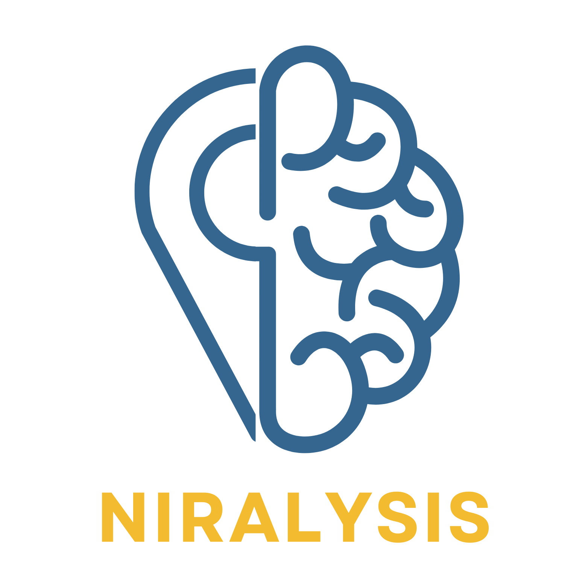

<a name="readme-top"></a>


<!-- PROJECT LOGO -->
<br />
<div align="center">
  <a href="https://github.com/Amit-Freiman/Niralysis">
    
  </a>

<h3 align="center">NIRalysis</h3>

  <p align="center">
    An extensive library for dealing with fNIRS data anylsis.
    <br />
    <a href="https://github.com/Amit-Freiman/Niralysis"><strong>Explore the docs »</strong></a>
    <br />
    <br />
    <a href="https://github.com/Amit-Freiman/Niralysis">View Demo</a>
    ·
    <a href="https://github.com/Amit-Freiman/Niralysis/issues">Report Bug</a>
    ·
    <a href="https://github.com/Amit-Freiman/Niralysis/issues">Request Feature</a>
  </p>
</div>

<div align="center">

<!-- PROJECT SHIELDS -->
[![Contributors][contributors-shield]][contributors-url]
[![Forks][forks-shield]][forks-url]
[![Issues][issues-shield]][issues-url]
[![MIT License][license-shield]][license-url]

</div>
<!-- TABLE OF CONTENTS -->
<details>
  <summary>Table of Contents</summary>
  <ol>
    <li>
      <a href="#about-the-project">About The Project</a>
      <ul>
        <li><a href="#built-with">Built With</a></li>
      </ul>
    </li>
    <li>
      <ul>
        <li><a href="#prerequisites">Prerequisites</a></li>
      </ul>
    </li>
    <li><a href="#usage">Usage</a></li>
    <li><a href="#roadmap">Roadmap</a></li>
    <li><a href="#contributing">Contributing</a></li>
    <li><a href="#license">License</a></li>
    <li><a href="#contact">Contact</a></li>
    <li><a href="#acknowledgments">Acknowledgments</a></li>
  </ol>
</details>


<!-- ABOUT THE PROJECT -->
## About The Project

NIRalysis - A Python Package for fNIRS Data Analysis

NIRalysis is a Python package designed to facilitate the analysis of functional Near-Infrared Spectroscopy (fNIRS) data. This tool enables the processing of fNIRS output files, known as "snirf" files, while enhancing them with precise probe location information obtained from STORM files.  NIRalysis also takes OpenPose data which detect human body, hand, facial, and foot keypoints out of video footage and integrate the information with snirf data. By fusing fNIRS data with accurate probe coordinates and head movement according to timestamps, NIRalysis provides more accurate and reliable research and insights.

<p align="right">(<a href="#readme-top">back to top</a>)</p>


### Built With
* [![SNIRF][snirf-shield]][snirf-url] 
<p align="right">(<a href="#readme-top">back to top</a>)</p>

<!-- Prerequisites -->

### Prerequisites
Our package code facilitates the processing of output files containing the following application. These application are integral components of the package, which can be either downloaded or utilized in conjunction with their respective output files.

* [![STORM][STORM-shield]][STORM-url]
* [![OpenPose][OpenPose-shield]][OpenPose-url]

<p align="right">(<a href="#readme-top">back to top</a>)</p>


<!-- USAGE EXAMPLES -->
## Usage

```python
import niralysis


# Import .snirf file into niralysis object
file = niralysis('path to .snirf file')

# Replaces probe_location variable in .snirf file with digitized locations from STORM input
file.storm('path to STORM file')
# Provide a list of sources that are off-temaplate by default threshold of 20mm.
file.invalid_sourc(Threshold)
# Provide a list of detectors that are off-temaplate by default threshold of 20mm.
file.invalid_detec(Threshold)

# Generates attributes: 
# data (Raw data combined from json files)
# changed_frames (Timestampsand the changes in keypoints)
# motion_label (Timestamps for a given label)
file.generate_open_pose('path to openpose output folder')

```

<p align="right">(<a href="#readme-top">back to top</a>)</p>


<!-- ROADMAP -->
## Roadmap

- [X] Add general method 'storm'
- [X] Add general method 'generate_open_pose'
- [ ] Check pytest works 
- [ ] Package library
- [ ] Next steps
    - [ ] Add method filter_by_labels
    - [ ] Add hand movement labels to method 'generate_open-pose'
    - [ ] Add check_optode_drift (next step for method 'storm')      

See the [open issues](https://github.com/github_username/repo_name/issues) for a full list of proposed features (and known issues).

<p align="right">(<a href="#readme-top">back to top</a>)</p>

<!-- CONTRIBUTING -->
## Contributing

Contributions are what make the open source community such an amazing place to learn, inspire, and create. Any contributions you make are **greatly appreciated**.

If you have a suggestion that would make this better, please fork the repo and create a pull request. You can also simply open an issue with the tag "enhancement".
Don't forget to give the project a star! Thanks again!

1. Fork the Project
2. Create your Feature Branch (`git checkout -b feature/AmazingFeature`)
3. Commit your Changes (`git commit -m 'Add some AmazingFeature'`)
4. Push to the Branch (`git push origin feature/AmazingFeature`)
5. Open a Pull Request

<p align="right">(<a href="#readme-top">back to top</a>)</p>


<!-- LICENSE -->
## License

Distributed under the MIT License. See `LICENSE.txt` for more information.

<p align="right">(<a href="#readme-top">back to top</a>)</p>


<!-- CONTACT -->
## Contact

Amit Freiman - amitfreiman@mail.tau.ac.il

Project Link: [https://github.com/github_username/repo_name](https://github.com/github_username/repo_name)

<p align="right">(<a href="#readme-top">back to top</a>)</p>

<!-- ACKNOWLEDGMENTS -->
## Acknowledgments

* []()
* []()
* []()

<p align="right">(<a href="#readme-top">back to top</a>)</p>


<!-- MARKDOWN LINKS & IMAGES -->
<!-- https://www.markdownguide.org/basic-syntax/#reference-style-links -->
[contributors-shield]: https://img.shields.io/github/contributors/Amit-Freiman/Niralysis.svg?style=for-the-badge
[contributors-url]: https://github.com/Amit-Freiman/Niralysis/graphs/contributors
[forks-shield]: https://img.shields.io/github/forks/Amit-Freiman/Niralysis.svg?style=for-the-badge
[forks-url]: https://github.com/Amit-Freiman/Niralysis/forks
[issues-shield]: https://img.shields.io/github/issues/Amit-Freiman/Niralysis.svg?style=for-the-badge
[issues-url]: https://github.com/github_username/repo_name/issues
[license-shield]: https://img.shields.io/github/license/Amit-Freiman/Niralysis.svg?style=for-the-badge
[license-url]: https://github.com/Amit-Freiman/Niralysis/blob/main/LICENSE
[STORM-shield]: https://img.shields.io/badge/STORM-F2BB30
[STORM-url]: https://github.com/yoterel/STORM-Net
[OpenPose-shield]:https://img.shields.io/badge/OpenPose-35668F
[OpenPose-url]: https://github.com/CMU-Perceptual-Computing-Lab/openpose
[snirf-shield]: https://img.shields.io/badge/snirf-F2BB30
[snirf-url]: https://github.com/fNIRS/snirf
